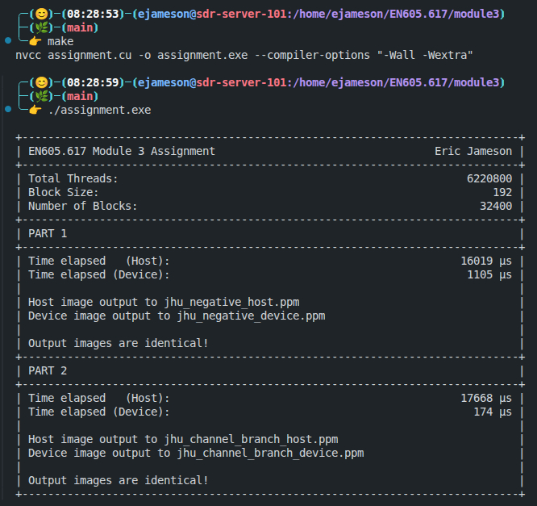
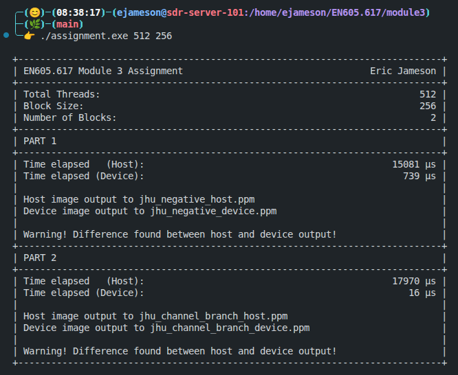
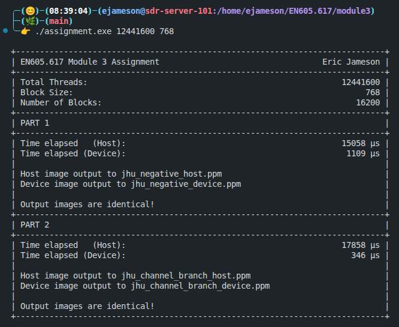
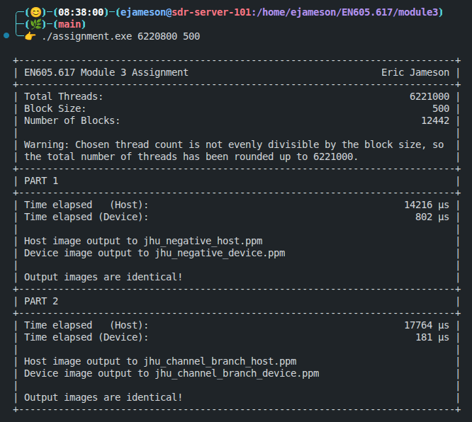

# Module 3 Assignment - Eric Jameson

This folder contains the Module 3 assignment for EN605.617 - Introduction to GPU Programming. Most of the existing content in this folder has been removed so that only the assigment and relevant materials remain.

## Description

Both parts of this assignment operate on a PPM image, which is contained in this folder as `jhu.ppm`. For more information on the PPM image format, see [below](#ppm-image-format). The provided image is $1920 \times 1080$ pixels, and each pixel contains $3$ bytes of information, one for each of the red/green/blue (RGB) channels. Because of this, the default number of threads chosen for this assignment is $1920 \times 1080 \times 3 = 6220800$. The default block size is chosen as $192$, which evenly divides the default number of threads.

For both parts, note that choosing a number of threads less than $6220800$ will create differences between the CPU-only implementation, which operates on the entire image no matter what, and the GPU implementation, which only uses the number of threads prescribed by the command-line arguments. This is indicated by a message of `Warning! Difference found between host and device output!` in the terminal output of each part. This is expected behavior.

On the other hand, choosing a number of threads greater than or equal to $6220800$ should mean that the CPU-only implementation's and GPU implementation's output images are identical. This is indicated by a message of `Output images are identical!` in the terminal output of each part.

## PPM Image Format

The PPM (Portable Pixel Map) image format is very simple and easy to manipulate programmatically. Here is a sample .ppm file:

```txt
P6
4 4
255
0  0  0    100 0  0     0  0  0    255   0 255
0  0  0     0 255 175   0  0  0     0    0  0
0  0  0     0  0  0     0 15 175    0    0  0
255 0 255   0  0  0     0  0  0    255  255 255
```

The image consists of the following components:

1. The magic bytes "P6", followed by a newline
2. The width and height of the image separated by a space, followed by a newline,
3. The maximum value to be found for any of the RGB channels, followed by newline. Typically, this value is 255.
4. The raster, consisting of RGB values (in that order) for each pixel.

Further information can be found at [this link](https://netpbm.sourceforge.net/doc/ppm.html).

### Part 1

The first part of this assignment reads in the input image `jhu.ppm`, then creates a negative image by inverting each of the RGB values. In other words, if pixel `i` in the input image is described by RGB values of $(r,g,b)$, then pixel `i` in the output image is described by RGB values of $(255-r, 255-g, 255-b)$. For the CPU-only implementation, this is done in a `for` loop, with no additional branching. For the GPU implementation, there is one check to ensure that the thread index is not beyond the bounds of the image, but otherwise, no branching is involved.

The input and expected output images are shown below:

Input Image                                       |  Expected Output Image
--------------------------------------------------|-------------------------
  |  

### Part 2

The second part of this assignment introduces branching for each channel of each pixel. The red values are inverted, as in part 1, the green values are divided by 2, and the blue values are left as is. In other words,  if pixel `i` in the input image is described by RGB values of $(r,g,b)$, then pixel `i` in the output image is described by RGB values of $(255-r, \lfloor g/2 \rfloor, b)$. This introduces a branch depending on the value of the thread index modulo 3.

The input and expected output images are shown below:

Input Image                                       |  Expected Output Image
--------------------------------------------------|-------------------------
  |  

## Example Terminal Output

Here is a screenshot showing successful compilation of the assignment and output with default arguments (i.e., no additional command-line arguments).



This image shows a successful run of the assignment program with a number of threads smaller than the image size, indicated by differences in the host and device output.



This image shows a successful run of the assignment program with a number of threads larger than the image size, and a different block size.



This final image shows a successful run of the assignment program with a block size that does not evenly divide the number of threads. This is indicated by a message and the total number of threads being rounded up so that it is evenly divisible by the block size.



## Discussion

I encountered what I considered to be counter-intuitive behavior on the second part of this assignment. For the first part, each thread on the GPU is performing the exact same operation, and I assumed that this would be the easier of the two operations. There is plenty of room for compilier optimization and thus it should be a very quick operation overall.

For the second part of the assignment, each set of three consecutive threads is performing a different operation. I assumed that this would be similar to the "worst case" branching discussed in the lectures, and that performance would be much worse for the GPU kernel. However, this was not the case. I may not be doing everything exactly correctly, but I could not figure out what was happending to make the part 2 kernel run 3-4 times faster than the part 1 kernel. I think this goes to show that I do not completely understance how GPUs process data, or maybe there's some optimization going on behind the scenes that is making the compiled code more optimal in some way.

## Part 5

Overall, the code given in the assignment seems like a solid attempt at this sort of comparison between a GPU kernel and a CPU-only function. It appears that both the host and device arrays are allocated and freed correctly, the host arrays are `cudaMemcpy`'d correctly to the device, and the result of running the kernel is `cudaMemcpy`'d back to the host correctly. It also appears that the timing is done in a standard way and displayed clearly to the user.

Although I didn't notice any glaring mistakes or major misconceptions when looking at this code, I did have a few small concerns. Keep in mind, this is without seeing the implementations of the `add` kernel or the `addHost` function:

1. After the `c` array is written with the output of the `add` kernel (copied from `dev_c`), it is immediately overwritten in the next call to the `addHost` function. I would like to see some sort of comparison that ensures the outputs from the `add` kernel and `addHost` function match.
2. Although I'm not completely confident on this, in my research this week, I learned that there is a more idiomatic way to time GPU execution using CUDA built-in functions. This is done with calls to `cudaEventCreate`, `cudaEventRecord` and `cudaEventElapsedTime`. I'm not sure if this will have a major impact on the output of the program, but it might give a more accurate timing of the kernel execution.
3. Without seeing what `N` is, my first impressions of the default number of threads and blocks is that they are much too low. In fact, I would guess that such a small number of threads and blocks could lead to the CPU function running faster than the GPU kernel. A much larger number of blocks and threads (and probably `N`) should be given as default so that the GPU can really show its performance.
